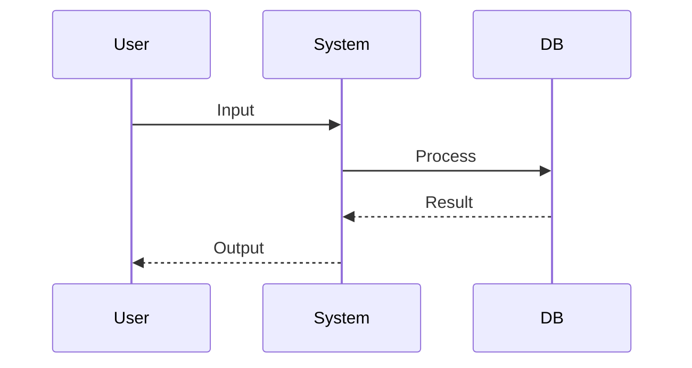

# RFC 0000: [Title]

| Meta | Details |
| :--- | :--- |
| **Status** | DRAFT / REVIEW / APPROVED / DEPRECATED |
| **Date** | YYYY-MM-DD |
| **Author** | [Name] |
| **JIRA** | [{JIRA_ID}]({BASE_JIRA_URL}/browse/{JIRA_ID}) |
| **References** | [Link to Doc 1], `filename.md`, [Design FigJam] |

## 1. Context & Problem Statement
*What is the problem? Why do we need to make this decision? What is the business value?*

## 2. Proposed Solution (High Level)
*Brief summary of the approach. Explain "How it works" simply.*

---

## 3. Technical Design

### 3.1 Sequence Diagram


### 3.2 Interface Definition (Choose One)
#### 🅰️ Option A: REST / HTTP
- **Endpoint:** `POST /v1/resource`
- **Request:**
  ```json
  { "field": "value" }
  ```
- **Response (200 OK):**
  ```json
  { "id": "123" }
  ```

#### 🅱️ Option B: gRPC (Protobuf)
- **Service:** `PaymentService`
- **RPC:** `rpc ProcessPayment(PaymentRequest) returns (PaymentResponse)`
- **Proto Snippet:**
  ```protobuf
  message PaymentRequest {
    string user_id = 1;
    int64 amount = 2;
  }
  ```

#### © Option C: GraphQL
- **Type:** Query / Mutation
- **Signature:**
  ```graphql
  mutation CreateOrder($input: CreateOrderInput!) {
    createOrder(input: $input) {
      id
      status
    }
  }
  ```

#### ⓓ Option D: CLI Command
- **Command:** `ag-cli deploy [service-name]`
- **Flags:**
  - `--dry-run`: Preview changes.
- **Output:**
  ```text
  Deploying... [OK]
  ```

### 3.3 Database Schema Changes
| Table | Column | Type | Index? | Description |
| :--- | :--- | :--- | :--- | :--- |
| `users` | `status` | ENUM | ❌ | Added 'archived' state |

### 3.4 Business Logic & Algorithm
1.  **Validation:** Input check.
2.  **Process:** Core logic.
3.  **State:** Persistence.

### 3.5 🧪 BDD Scenarios (The Contract)
**Feature:** [Feature Name]

#### 📧 Core Scenarios (Happy Path)
| ID | Scenario | Given (Pre-condition) | When (Action) | Then (Expected Result) |
| :--- | :--- | :--- | :--- | :--- |
| **SC-01** | **Success Case** | User is active | Calls API/CMD | Success response received |

#### 🛡️ Operational & Edge Cases
| ID | Scenario | Given (Pre-condition) | When (Action) | Then (Expected Result) |
| :--- | :--- | :--- | :--- | :--- |
| **SC-ERR-01** | **Validation Fail** | Invalid Input | Calls API/CMD | Error message displayed |

---

## 4. Cross-Repo Impact (The Bridge)
- **Affected Repos:** [List Repos]
- **Contract Changes:**
  - [ ] `proto/`: New field added.
  - [ ] `openapi/`: Endpoint deprecated.

## 5. Security & Privacy (The Auditor)
### 5.1 AuthN & AuthZ
- **Identity:** How is the caller verified? (JWT / API Key / IAM Role)
- **Scope:** What permissions are needed?

### 5.2 Data Protection
- **PII:** Does this touch PII? [Yes/No]

---

## 6. Operational Considerations
### 6.1 Configuration
| Key | Type | Default | Description |
| :--- | :--- | :--- | :--- |
| `ENABLE_FEATURE` | Flag | `false` | Rollout control |

### 6.2 Observability
- **Metrics:** Key counters/histograms.
- **Logs:** Important log events.

### 6.3 Migration Strategy
- **Rollout Plan:**
  1.  [ ] Step 1...
  2.  [ ] Step 2...

## 7. Verification Plan
- [ ] **Unit Tests:** Cover all BDD Scenarios.
- [ ] **Integration:** Test end-to-end.