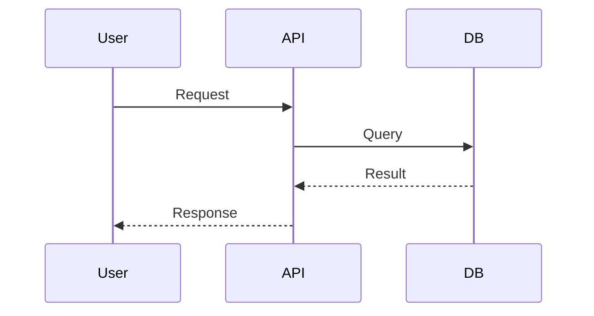

# RFC 0000: [Title]

| Status | Proposed / Accepted / Deprecated |
| :--- | :--- |
| **Date** | YYYY-MM-DD |
| **Author** | [Name] |
| **JIRA** | [{JIRA_ID}]({BASE_JIRA_URL}/browse/{JIRA_ID}) |
| **Parent RFC** | [Link] (Optional) |

## 1. Context & Problem Statement
*What is the problem? Why do we need to make this decision?*

## 2. Proposed Solution (High Level)
*Brief summary of the approach.*

---

## 3. Technical Design

### 3.1 Sequence Diagram


### 3.2 API Endpoint (If applicable)
- **Method:** `POST /...`
- **Request Body:**
  ```json
  {}
  ```
- **Response:**
  ```json
  {}
  ```

### 3.3 Database Schema Changes
| Table | Column | Type | Description |
| :--- | :--- | :--- | :--- |
| `users` | `status` | ENUM | Added 'archived' state |

### 3.4 Business Logic / Algorithm
<!-- Keep this high-level. DO NOT write actual code here. Use flowcharts or pseudocode. -->
1. Step 1...
2. Step 2...

### 3.5 Cross-Repo Impact & Contracts
- **Affected Repos:** [List Repos e.g., `payment-service`, `frontend-dashboard`]
- **Contract Changes:**
  - [ ] `common/proto`: New field `currency_code` added.
  - [ ] `openapi/spec`: Endpoint `/v1/charge` deprecated.
- **Breaking Change?** [Yes/No] (If Yes, link to Migration Plan)

### 3.6 Consistency & Concurrency
- **Transaction Scope:** (e.g. SAGA Pattern, 2-Phase Commit, or localized DB tx)
- **Race Conditions:** How do we handle double-submit? (e.g. Idempotency Key)

---

## 4. Security & Privacy

### 4.1 Authentication (AuthN) & Authorization (AuthZ)
- **Identification:** How is the user identified? (e.g., JWT, Session)
- **Permissions:** What roles can access this? Is there a Check-Permission call?

### 4.2 Data Protection
- **PII:** Does this store Personally Identifiable Information?
- **Encryption:** Is data encrypted at rest/in transit?
- **Logging:** Ensure no secrets or PII are leaked in logs.

### 4.3 Threat Modeling (The "What If")
- [ ] What if the input is malicious (SQLi, XSS)?
- [ ] What if the user tries to access another user's ID (BOLA)?

---

## 5. Operational Considerations

### 5.1 Config / Env Vars
- `MY_NEW_VAR`: Description

### 5.2 Error Handling
- How do we handle failures? Retry logic?

### 5.3 Metrics & Monitoring
- What success metrics are we tracking?

## 6. Alternatives Considered
*What other options did we reject and why?*

## 7. Verification Plan
- [ ] Unit Tests: `make test`
- [ ] Manual E2E Scenarios:
    1. Scenario A...
    2. Scenario B...
